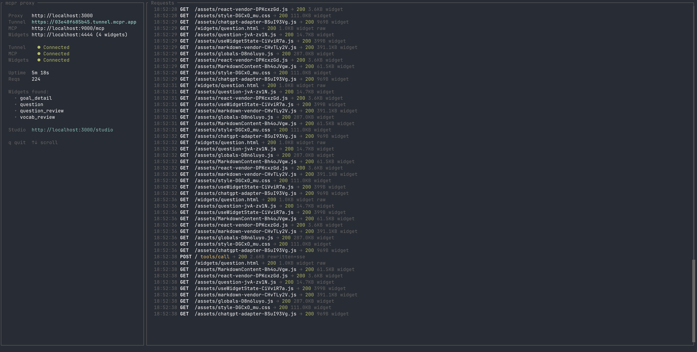
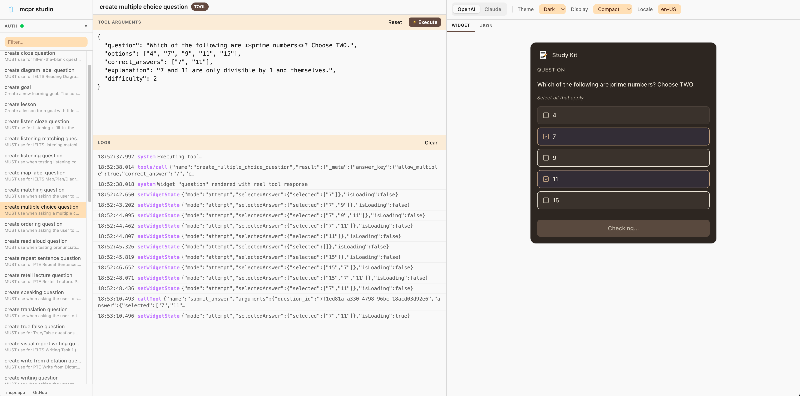

<p align="center">
  
</p>

<h1 align="center">mcpr</h1>

<p align="center">
  Proxy layer for <a href="https://modelcontextprotocol.io/extensions/apps/overview">MCP App</a> (ChatGPT App SDK, Claude Customize, etc) — tunnel, test, and debug your MCP App from localhost.
</p>



## Install

```bash
curl -fsSL https://raw.githubusercontent.com/cptrodgers/mcpr/main/scripts/install.sh | sh
```

## Features

### MCP Tunnel

Expose your local MCP server to ChatGPT, Claude, or any AI client — one command, public HTTPS.

```bash
mcpr --mcp http://localhost:9000
# → https://abc123.tunnel.mcpr.app
```

Running widgets server/static assets too? mcpr merges both services behind a single URL. `/mcp` routes to your backend, everything else serves your widgets.

```bash
mcpr --mcp http://localhost:9000 --widgets http://localhost:4444
# → https://abc123.tunnel.mcpr.app       (one URL, two services)
```

```
Your machine                           AI client (ChatGPT / Claude)
┌─────────────────┐
│ MCP server      │◄──┐
│ :9000           │   │
└─────────────────┘   │    mcpr         tunnel
                      ├──────────── ◄──────────── https://abc123.tunnel.mcpr.app
┌─────────────────┐   │
│ Widgets         │◄──┘
│ :4444           │
└─────────────────┘
```

The URL stays the same across restarts — configure your AI client once, keep developing.

### mcpr Studio

Test your MCP tools and preview widgets locally — no AI model, no API key, no subscription. Studio simulates what ChatGPT and Claude do:

- **Call tools** — execute your MCP tools with custom input and see raw responses
- **Render & interact with widgets** — preview the returned UI and interact with it just like a user would on ChatGPT or Claude, testing the full widget flow end-to-end
- **Inspect actions** — trace every action your widget fires back to the host
- **Switch platforms** — toggle between OpenAI and Claude simulation modes



### Edge Config

Like Nginx or Caddy for your MCP app — move environment-specific config out of your application and into the proxy layer.

AI clients require CSP headers, widget domains, and OAuth URLs tailored to each environment. Instead of hardcoding these in your MCP server, mcpr rewrites them at the edge — automatically, for both OpenAI and Claude formats.

- **CSP headers** — inject or extend Content Security Policy per environment
- **Widget & OAuth domains** — rewrite URLs so your server stays environment-agnostic
- **Zero redeploy** — change config at the proxy, not in your application

## Why mcpr over a generic tunnel?

A generic tunnel (ngrok, Cloudflare Tunnel, etc.) gets you a public URL — that's it. mcpr is purpose-built for MCP App development:

- **One URL, two services** — MCP server + widget dev server merged behind a single endpoint with automatic routing. No need for separate tunnels.
- **Hot reload** — proxy to your Vite/webpack dev server for instant feedback instead of rebuilding and re-bundling on every change.
- **Asset path rewriting** — relative paths like `/style.css` break inside sandboxed iframes. mcpr rewrites them to the tunnel URL automatically.
- **CSP at the proxy layer** — AI clients require specific Content Security Policy headers. mcpr injects them per environment so your server stays agnostic.
- **Studio** — test tools and widgets locally without connecting to a real AI client.

## Getting Started

mcpr looks for `mcpr.toml` in the current directory (then parent dirs). CLI args override config values.

### MCP server only

Tunnel your MCP server — no widgets.

```toml
# mcpr.toml
mcp = "http://localhost:9000"
```

```bash
mcpr
# → https://abc123.tunnel.mcpr.app
```

### MCP server + widgets

Merge both services behind one URL.

```toml
# mcpr.toml
mcp = "http://localhost:9000"
widgets = "http://localhost:4444"
```

```bash
mcpr
# → https://abc123.tunnel.mcpr.app
```

On first run, mcpr generates a stable tunnel token and saves it to `mcpr.toml`. The URL stays the same across restarts.

### Local only (no tunnel)

For local clients like Claude Desktop, VS Code, or Cursor — no public URL needed.

```toml
# mcpr.toml
mcp = "http://localhost:9000"
no_tunnel = true
port = 3000
```

```bash
mcpr
# → http://localhost:3000/mcp
```

### Static widgets

Serve pre-built widgets from disk instead of proxying a dev server.

```toml
# mcpr.toml
mcp = "http://localhost:9000"
widgets = "./widgets/dist"
```

### Self-hosted relay

Run your own tunnel relay instead of using `tunnel.mcpr.app`. This requires wildcard DNS, TLS termination (e.g. Cloudflare Tunnel, Caddy, or nginx + Let's Encrypt), and careful configuration.

See [docs/DEPLOY_RELAY_SERVER.md](docs/DEPLOY_RELAY_SERVER.md) for the full guide before getting started.

The relay supports three auth modes -- open (anyone can tunnel), static tokens (hardcoded in config), or external auth provider (for dynamic token management). See [docs/AUTH_PROVIDER.md](docs/AUTH_PROVIDER.md) for details on building an auth provider.

## CLI

```
mcpr [OPTIONS]

Gateway mode (default):
  --mcp <URL>                     Upstream MCP server
  --widgets <URL|PATH>            Widget source (URL = proxy, PATH = static serve)
  --port <PORT>                   Local proxy port
  --csp <DOMAIN>                  Extra CSP domains (repeatable)
  --csp-mode <MODE>               CSP mode: "extend" (default) or "override"
  --relay-url <URL>               Custom relay server (env: MCPR_RELAY_URL)
  --no-tunnel                     Local-only, no tunnel

Relay mode:
  --relay                         Run as relay server
  --relay-domain <DOMAIN>         Relay base domain (required in relay mode)
  --auth-provider <URL>           Auth provider URL (env: MCPR_AUTH_PROVIDER)
  --auth-provider-secret <SECRET> Shared secret (env: MCPR_AUTH_PROVIDER_SECRET)
```

Config priority: **CLI args > environment variables > mcpr.toml > defaults**

See [`config_examples/`](config_examples/) for ready-to-use templates and [docs/CONFIGURATION.md](docs/CONFIGURATION.md) for the full reference.

## Contributing

Contributions are welcome! Please open an issue or submit a pull request.

## License

Apache 2.0 — see [LICENSE](LICENSE) for details.
